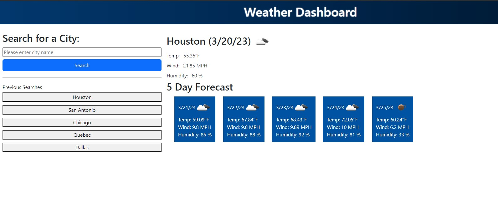

# 5DayForecast

A dynamic weather forecasting tool showing current day weather statistics, and the same statistics forecasted over the next 5 days.

Link to live application: https://misterbham.github.io/5DayForecast/

This application will show current and forecasted weather conditions for a given city, searchable simply by city name.
The application utilizes the OpenWeatherMap API to provide these dynamic results.

The application is dynamic in the sense that the API returns the current day, and will automatically update day by day, based on when the user interacts with the site. It can also remember previous searched cities and when selected, rather than manually inputting a city name, can re-query the API to return up to date information regarding that city again.

With the building of this application, I challenged myself by building the entire application in vanilla JS, and worked with localStorage to retain previous searches.
